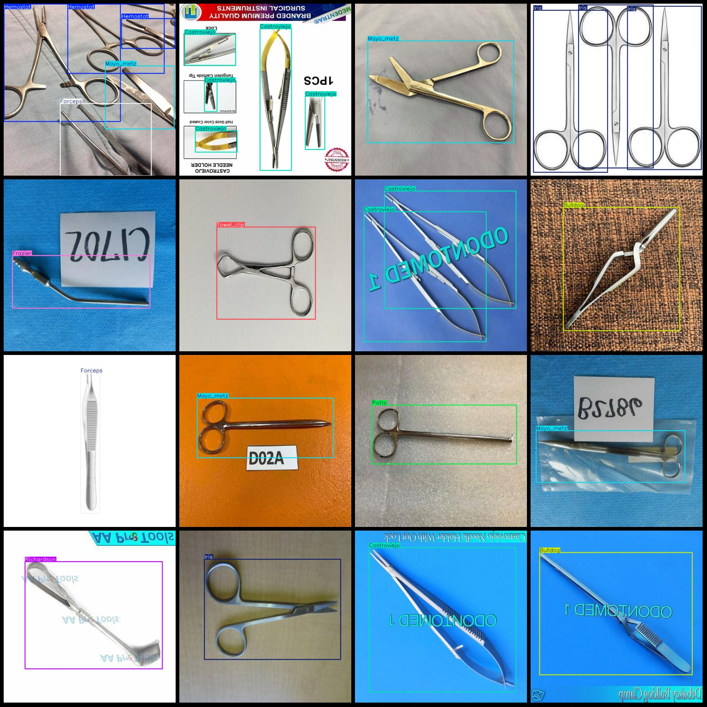
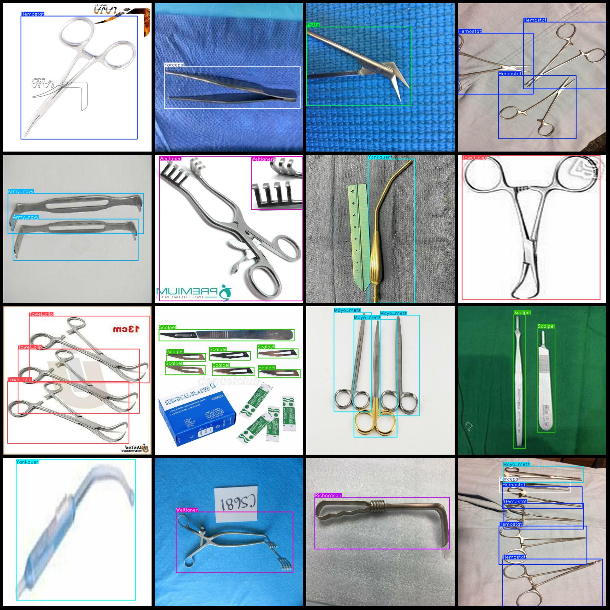

# Intelligent Medical Surgical Tools and Medical Device Detection Dataset in VOC+YOLO Format with 2273 Images across 15 Categories

Please note that approximately one-third of the dataset consists of original images, while the rest are enhanced versions primarily including rotation enhancement.

### Data Format
The dataset is in Pascal VOC format plus YOLO format (excluding the split path from a txt file, only containing JPG images and their corresponding VOC XML files and YOLO txt files).

### Image Count
Total number of JPG files: 2273
Number of XML files: 2273
Number of txt files: 2273
Number of categories: 15

### Category Numbers
Each category has been labeled with its corresponding number of frames in the YOLO format. The labels are based on the "classes.txt" file within the "labels" folder, which differs from the order 
specified in the yolo format.

#### Example of Annotation

[Annotation](annotation_text)

---

**Note**: The dataset does not include a training/validation/test split; users are required to manually divide the data into these groups.

**Disclaimer**: This dataset does not guarantee any accuracy improvement for models trained on it or any weight files associated with it.

**Preview Images**:

Please refer to the image previews provided to understand the content of each image and its corresponding label.
## Images

Here is a pay link on Stripe ( https://buy.stripe.com/3cs8yP7sY87d0vu9AB ). Please contact me lonlonago@foxmail.com after funding $89, and I will send you a complete data files , thank you!

